# Passo a Passo

1. Importar o PDF

    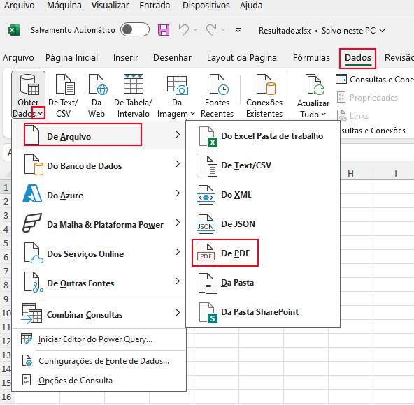

2. Selecionar apenas tabelas, clicar com o direito na primeira tabela e em seguida em transformar dados.

    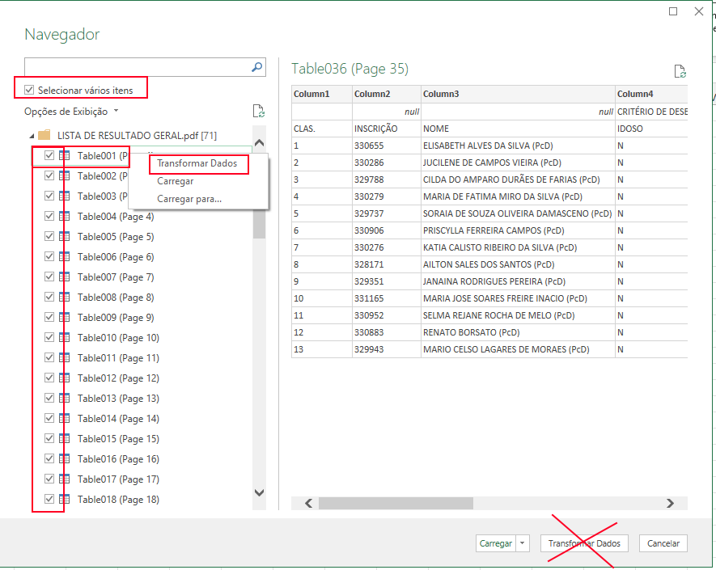

3. Remover a Navegação e Tipo Alterado que são criados automaticamente.
  
    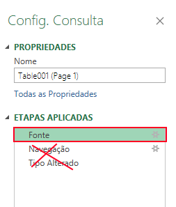

4. Manter apenas os objetos que são do tipo "Table"

    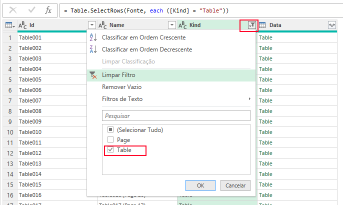

5. Remover colunas auxiliares que não serão usadas (Id e Kind)

    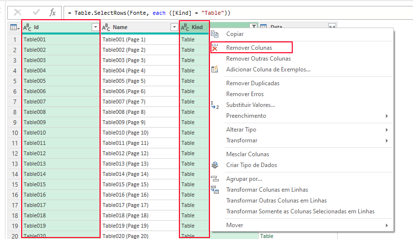

6. Expandir o conteúdo das tabelas

    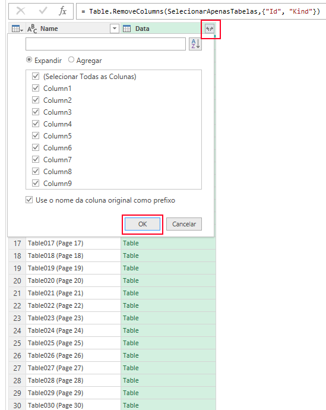

7. Remover linhas desnecessárias

    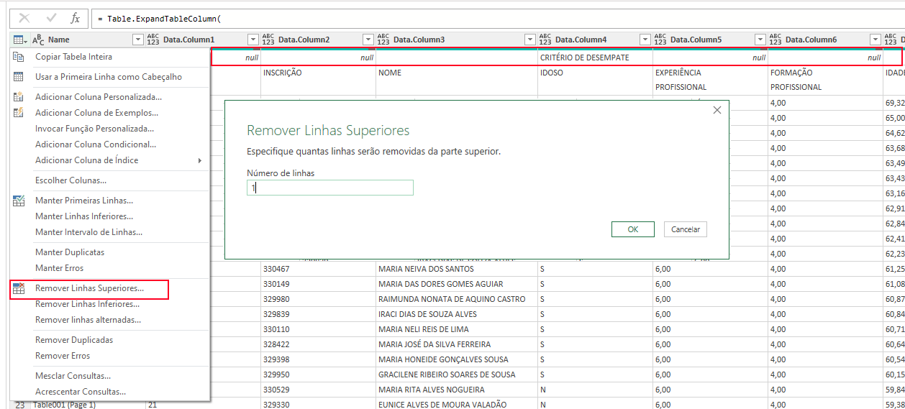

8. Usar a primeira linha de dados como cabeçalho da tabela

    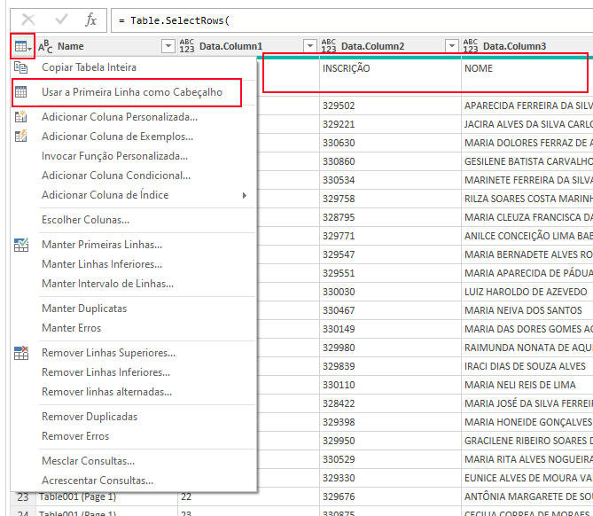

9. Dividir a coluna 

    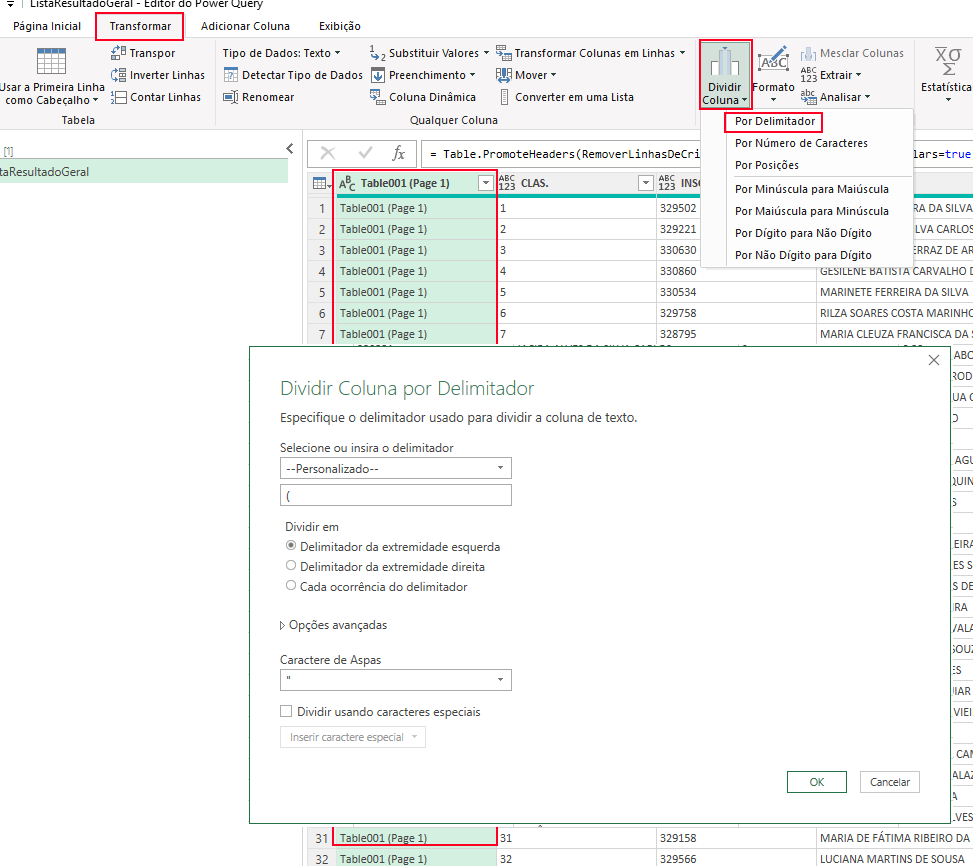

10. Remover caractere indesejado

    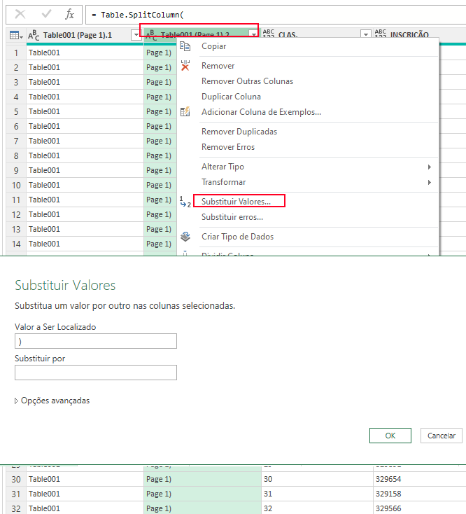

11. Remover coluna indesejada

    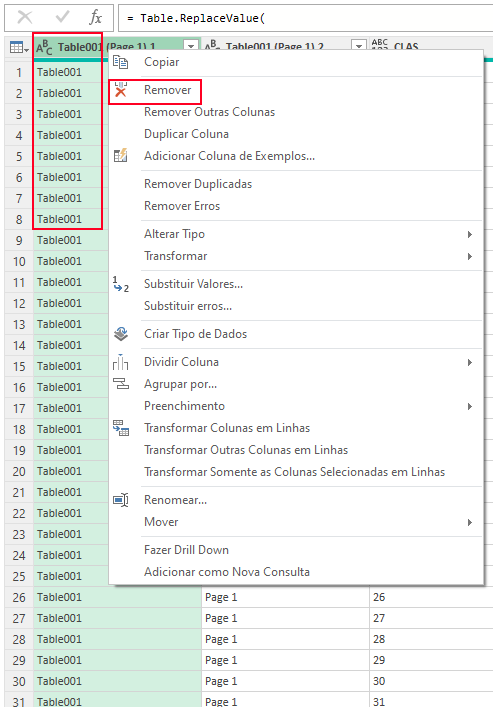

12. Colocar apenas a primeira letra do nome em maiúsculo

    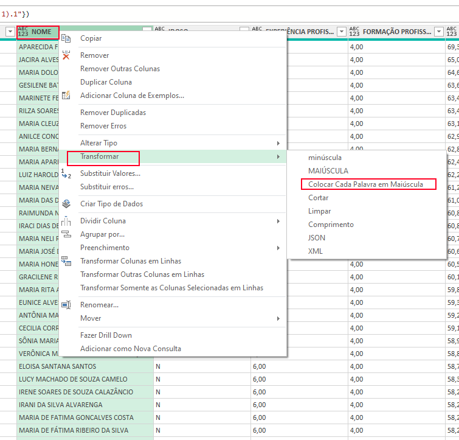

13. Separar nome e sobrenome

    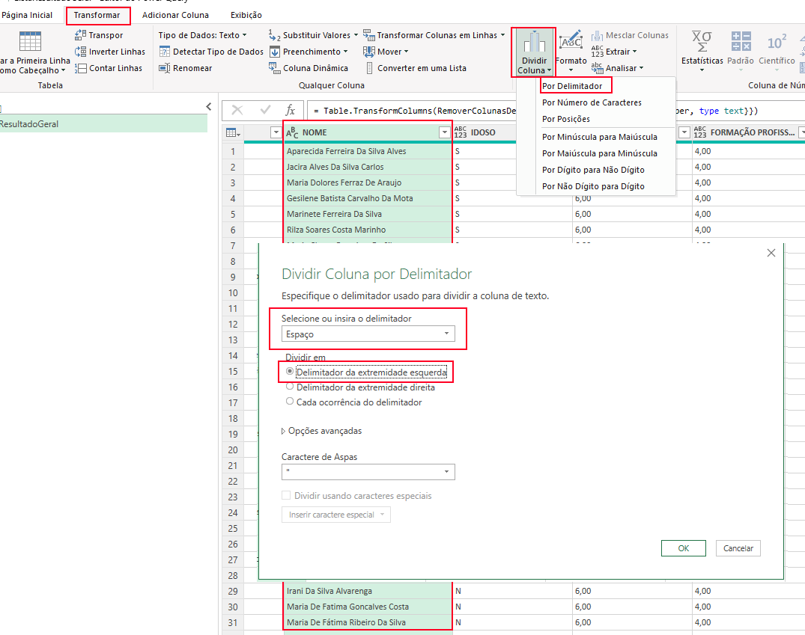

14. Renomear as colunas

    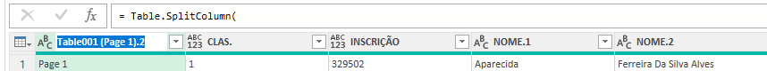

15. Remove linhas residuais

    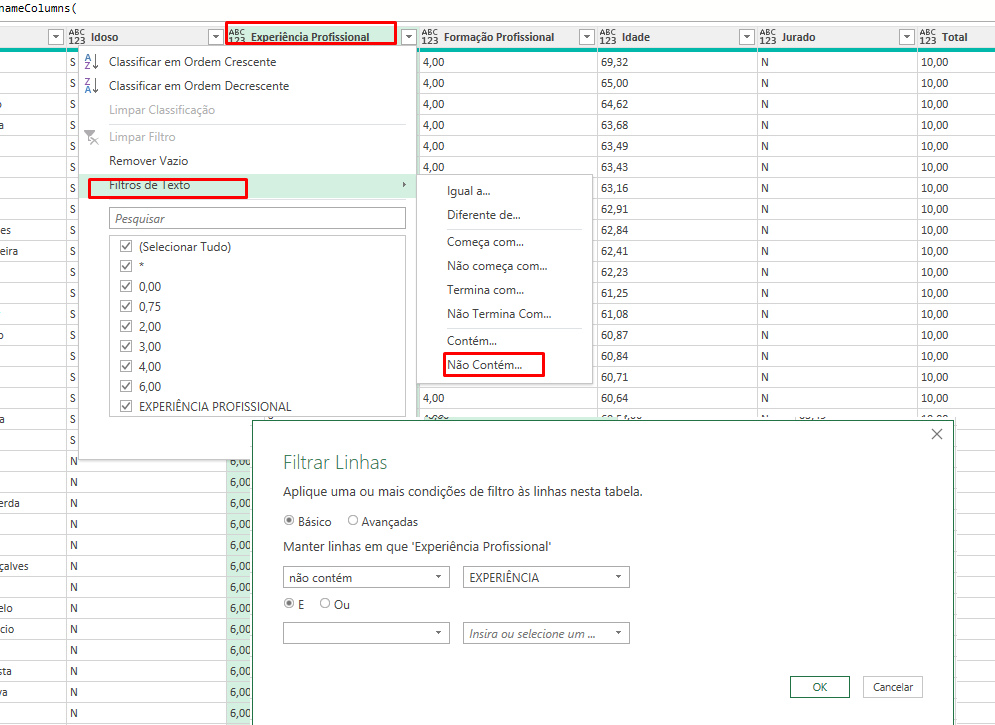

16. Tipar colunas

    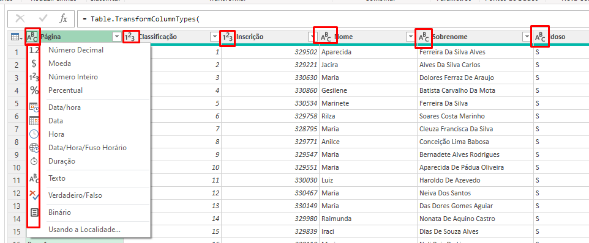

17. Criar coluna com a idade arredondada

    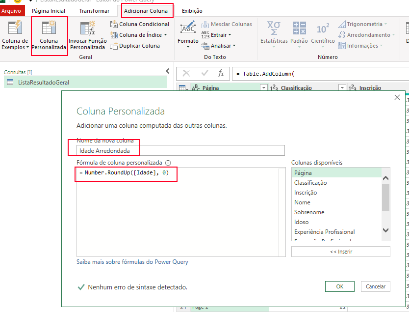

18. Criar coluna faixa etária

    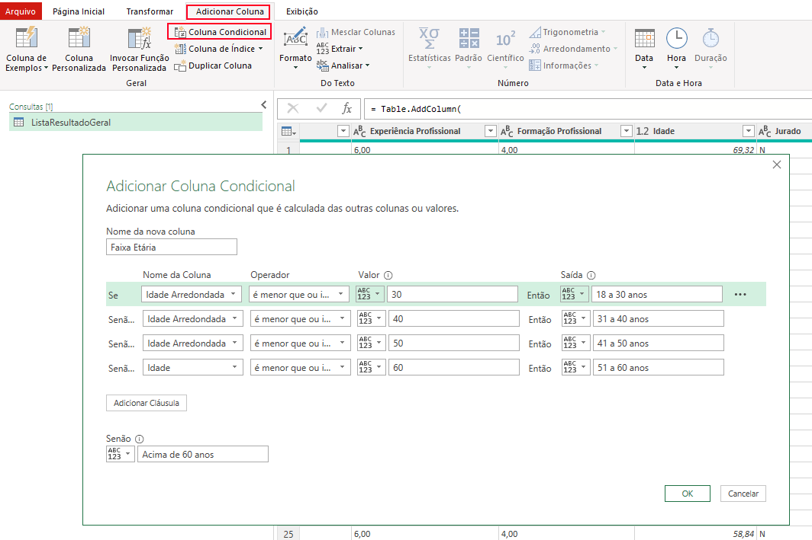