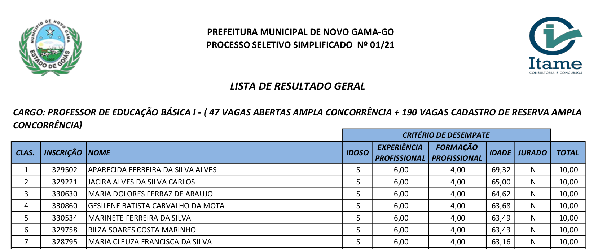
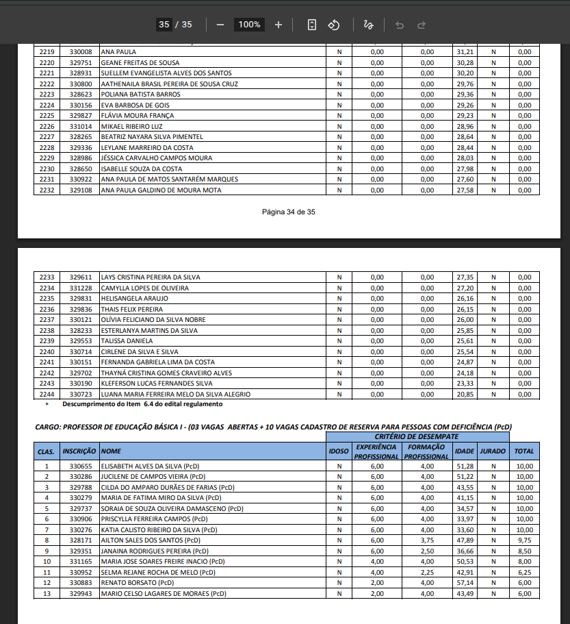
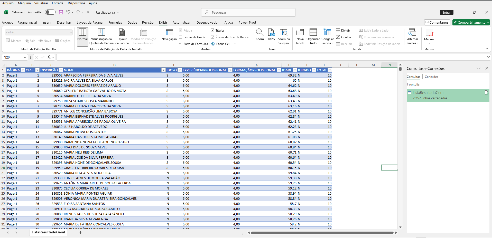
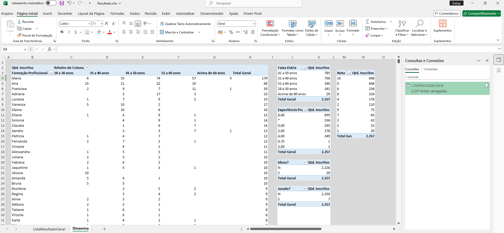

# 🧪 Power Query - Treinamento de ETL

Este projeto foi **desenvolvido por [Diego Carvalho](https://github.com/DiegoRCarvalho)** como um exercício prático de **ETL (Extração, Transformação e Carga)** utilizando o **Power Query** do Excel.  

O objetivo foi **transformar um arquivo PDF desestruturado** (resultado de concurso público) em uma **tabela organizada no Excel**, pronta para análise no **Power BI** ou em relatórios dinâmicos.  

[📄 Download do arquivo original](https://novogama.go.gov.br/res/midias/outros/7a0ca3ff0a1814b49a0738675bb85ed0.pdf)

---

## ⚠️ Aviso sobre os dados

> Os dados utilizados neste projeto são provenientes de um **concurso público**, disponibilizados de forma aberta no site da Prefeitura de Novo Gama - GO.  
> Este repositório tem **finalidade exclusivamente didática**, sem qualquer vínculo com o certame.

---

## 📁 Estrutura do projeto

```
power-query-0002/
│
├── LISTA DE RESULTADO GERAL.pdf
├── img/
│   ├── 0001.png             ← Imagem de um trecho do PDF original
│   ├── 0002.png             ← Imagem de um trecho do PDF original
│   ├── 0003.png             ← Imagem da tabela tratada
│   └── 0004.png             ← Imagem de tabelas dinâmicas possíveis de serem obtidas após o tratamento.
│
├── Tratamento.pq            ← Código M utilizado no Power Query para criar uma função com as etapas necessárias ao tratamento de dados.
├── Resultado.xlsx           ← Planilha contendo a tabela tratada.
└── README.md
```

---

## 🧰 Ferramentas utilizadas

- **Excel** (Power Query Editor)  
- **Linguagem M** (Power Query Formula Language)  
- **PDF** como fonte de dados  

---

## 🚀 Processo ETL realizado

### ✅ Antes (dados brutos):



---

### ⚙️ Transformações aplicadas

1. **📥 Importação de tabelas do PDF**  
   - Extração de todas as tabelas detectadas no arquivo com `Pdf.Tables`.

2. **🧹 Limpeza inicial**  
   - Remoção de colunas auxiliares (`Id`, `Kind`).  
   - Exclusão de linhas de cabeçalho repetidas, como “CRITÉRIO DE DESEMPATE”.

3. **🔄 Estruturação das tabelas**  
   - Expansão das colunas (`Column1` a `Column9`).  
   - Promoção da primeira linha como cabeçalho.

4. **✂️ Tratamento de colunas**  
   - Divisão e limpeza de colunas de página.  
   - Padronização de nomes (iniciais maiúsculas).  
   - Separação da coluna **NOME** em **Nome** e **Sobrenome**.  
   - Renomeação das colunas para títulos mais claros.

5. **🔧 Refinamento de dados**  
   - Remoção de linhas residuais com textos de cabeçalho.  
   - Conversão de tipos de dados (texto, número, inteiro).  

6. **➕ Enriquecimento dos dados**  
   - Coluna **Idade Arredondada** (usando `Number.RoundUp`).  
   - Coluna **Faixa Etária** (agrupando em categorias de 18 até >60 anos).

---

### 🟢 Resultado final:



---

## 📄 Código-fonte

Todo o tratamento foi escrito por mim em **Linguagem M** e pode ser consultado nos arquivos:  
- [`Tratamento.pq`](Tratamento.pq)  
- [`Resultado.xlsx`](Resultado.xlsx)  

📌 Autor: [**Diego Carvalho**](https://github.com/DiegoRCarvalho)  

---